## Arquitetura Escolhida 

### Arquitetura Física 
Para este challenge, optamos por fornecer os serviços de maneira on-premises, utilizando o banco NoSQL MongoDB para armazenamento dos dados e também uma docker própria para distribuição da aplicação. Segue abaixo diagrama simplificado da arquiteura escolhida

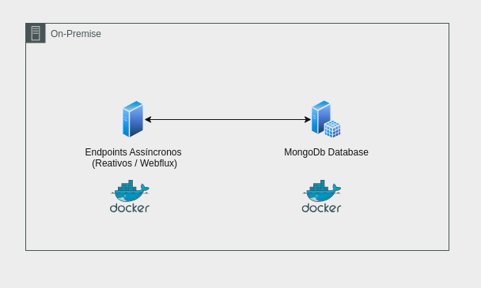

### Arquitetura lógica 
Para a arquitetura da aplicação (arquitetura lógica), definimos a Clean Architecture por ser um requisito da entrega do trabalho. 
Cabe ressaltar que o objetivo da clean architecture é focar na lógica e entidades de negócio, tendo como ideal fazer com que tecnologias "acessórias" como armazenamento, linguagens, frameworks, etc; sejam tratados como mero "detalhe". Dito isso, nem sempre é possível tratar todos os aspectos extra-negociais como mero datalhe, um exemplo é a escolha entre adotar um paradigma reativo (através do WebFlux) ou adotar o tradicional paradigma síncrono. Como será mostrado no decorrer dessa apresentação, tentar abstrair e tornar os paradigmas intercambiáveis traria maiores problemas que soluções, portanto, optamos por não abstrair o paradigma por não enxergarmos benefício (ou até mesmo viabilidade) em tal ação.

### Transição do MVC Para Clean Arch
**A Arquitetura MVC**
Nos desafios anteriores, estruturamos as aplicações da seguinte forma: 
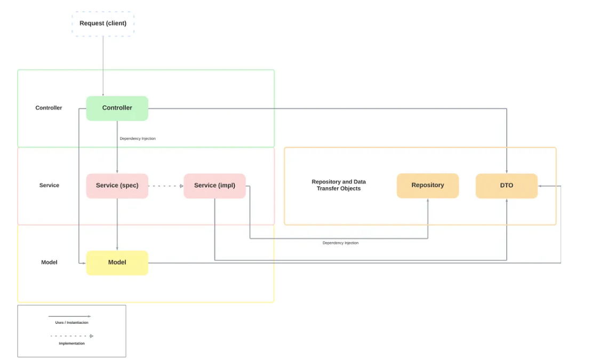

De maneira simplificada, nossa porta de entrada são os Controllers, que se comunicam com os Services através de mensagens trafegando DTOs. Os Services são definidos por contrato e implementados na mesma camada e tem a responsabilidade de comunicar-se com o modelo de nossa aplicação enquanto sequencia ações, encapsulando parte das regras de negócios e validações. Já o modelo encapsula as entidades e principais regras de negócio de nossa aplicação, comumente encapsulando nossa lógica de persistência também.

**A Clean Arch**
A arquitetura Limpa (Clean Arch), traz um outro olhar, procurando adicionar mais camadas de indereção a fim de isolar nossas camadas de negócio, usando a regra de que camadas mais interiores não devem conhecer detalhes das camadas mais exteriores (apenas as mais exteriores devem conhecer as interiores, conforme as setas do diagrama abaixo) enquanto ao mesmo tempo valoriza muito a separação de responsabilidades e todo o arcabouço do SOLID. O tradicional desenho abaixo ajuda a ilustrar como a arquitetura é vista em sua maneira ideal: 
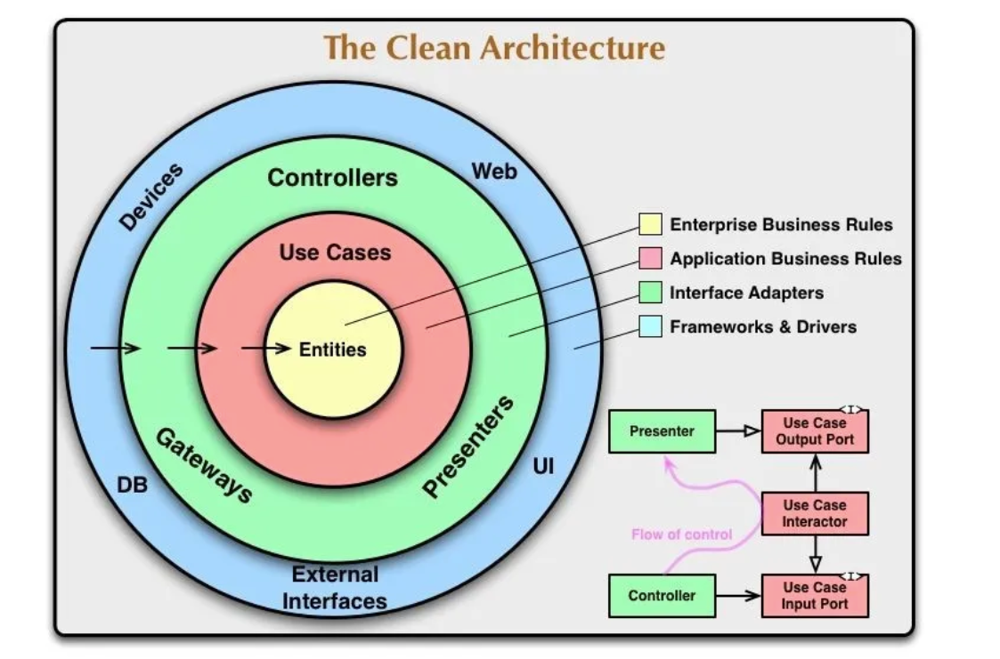

**O MVC enxergado através do Clean Arch**

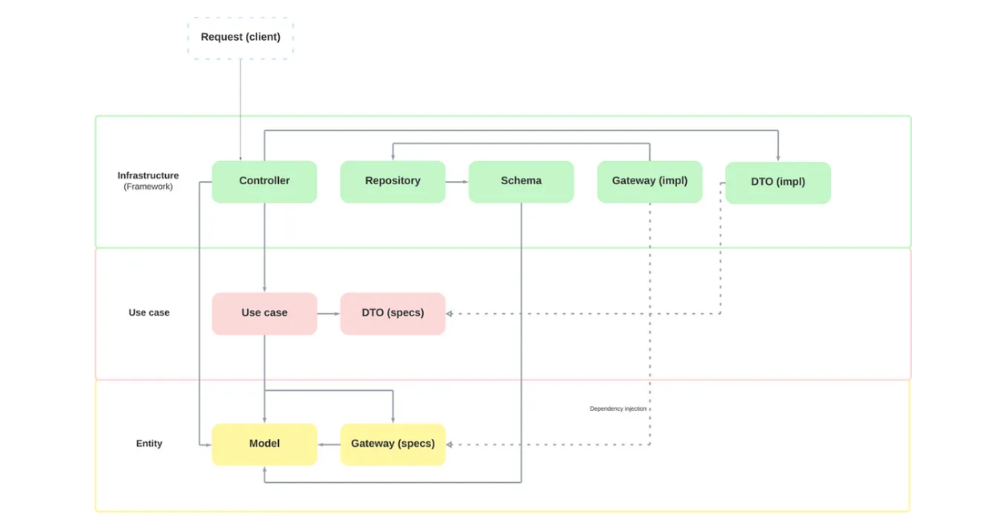

Conforme podemos ver na imagem acima (com o mesmo esquema de cores do Clean Arch) podemos exemplificar como se dará a estruturação de nossa arquitetura para o challenge. 
Basicamente, concentraremos em nossa camada mais interna as nossas entidades e **especificações de gateways**. 
Na camada intermediária encontraremos o sequenciamento de nossa lógica de negócio, os casos de uso propriamente ditos e a especificação dos DTOs que servirão de comunicação com nossa camada mais externa 
Já na camada mais externa teremos a parte ligada ao framework, os entrypoints de nossa aplicação, as representações de nossas entidades no banco (os schemas delas) e a implementação dos gateways que foram definidos na camada mais interna.
Uma visão bem resumida da organização de nossos pacotes segue abaixo: 
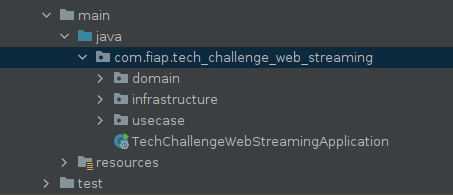
A seguir isolaremos cada camada trazendo exemplos de como foi realizado em nosso projeto.

---
**Entities**
Como dito acima, essa camada armazenará as entidades de nosso negócio e definirá o contrato que deverá ser implementado por nossos gateways, também inserimos nessa camada a representação das exceções de nosso projeto. 
Segue a organização dos pacotes: 
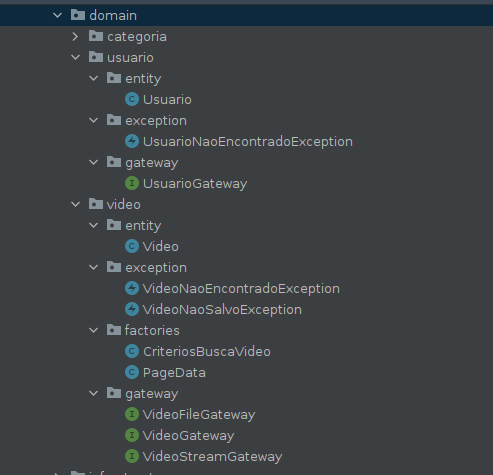
Nessa camada nossas entidades são representadas em seu estado puro, não utilizando nenhum tipo de anotação que gere acoplamento a algum framework de persistência, validação ou algo do gênero
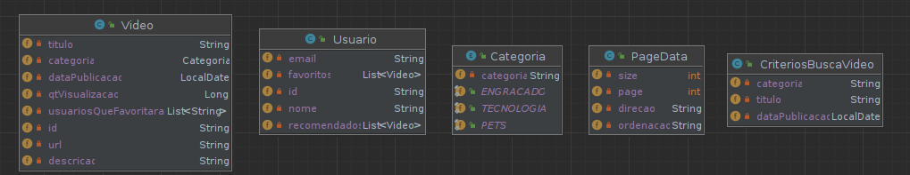
Também definimos as interfaces de nossos Gateways para especificar os contratos que deverão ser implementados para que nossa aplicação converse com os entes das camadas mais externas 
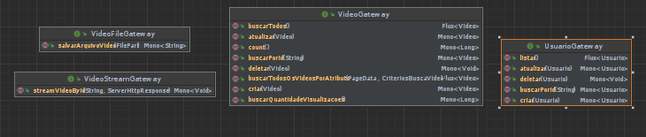
Reforçando que nesse ponto definimos apenas os contratos, o Gateway por si só existirá apenas na camada mais externa. 

----

### Use Cases

A camada de Use Case é a grande orquestradora de nossa aplicação, através dela realizaremos as ações que nossa aplicação deve prover para atender sua razão de existir.  
Basicamente realizamos a divisão de pacotes entre os Use Cases propriamente ditos e a especificação dos DTOs que serão usados para comunicação com a camada acima 
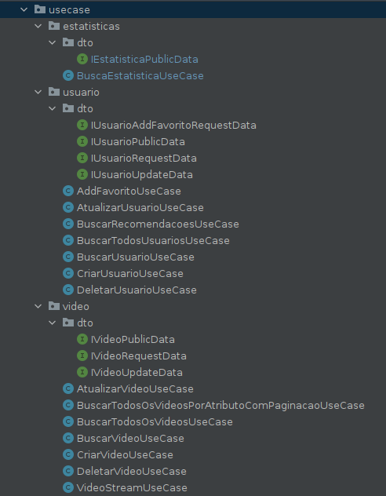
Usando o conceito de separação de responsabilidades, observe que cada classe de Use Case faz exatamente uma atividade. 
Outro detalhe importante de ressaltar é que nessa camada não há nenhuma injeção de dependencias sendo realizada através de anotações, uma vez que a camada de Use Cases também deve ser (o máximo possível) agnóstica de tecnologias externas como frameworks. 
 conforme pode ser visto no diagrama e exemplo abaixo 
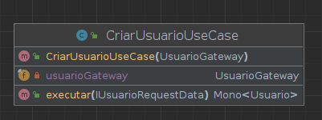

A classe receberá via injeção o Gateway para se comunicar com o as camadas mais exteriores (observe que passamos a interface e não uma implementação propriamente dita). 
Seu único método recebe o DTO responsável por representar os dados de entrada e retornará um Mono da entidade Usuário. Nesse ponto cabe uma importante observação: o Mono é uma representação da camada mais externa, do framework WebFlux, o que de certa quebraria a regra de não acoplar a camada mais interna com alguma tecnologia / framework. Porém **ao tomarmos decisões arquiteturais muito intrínsecas à aplicação, como trabalhar com o paradigma reativo, algumas abstrações não são proveitosas (ou até mesmo possíveis de serem realizadas)**, por exemplo, caso optássemos por retornar apenas um Usuario, ao invés de um Mono \<Usuario\>
iríamos comprometer a parte reativa de nossa aplicação, pois seria necessária uma chamada "block()" ou "subscribe()", tornando-a virtualmente síncrona, mesmo usando o paradigma reativo. 
Há situações em que precisaremos de mais de um gateway para realizar um casos de uso, como por exemplo, em nosso caso de uso de upload de vídeos, onde devemos salvar o arquivo e os metadados do mesmo. 
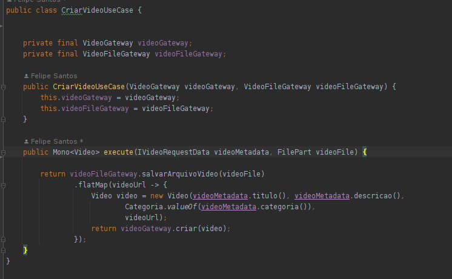

---
**Infraestructure**
Essa é a camada de maior tamanho de nossa aplicação, ela encapsulará as tecnologias, frameworks, acesso a dados, fronteiras da aplicação, etc.
Organizamos nossos pacotes dentro dessa camada da seguinte forma: 
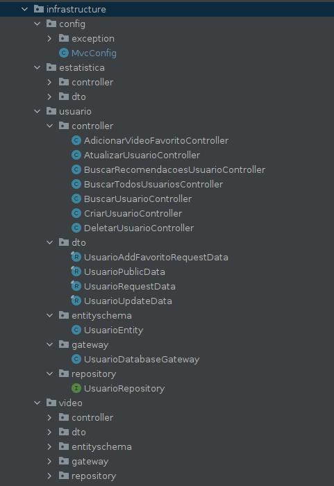
  De maneira geral, podemos abstrair da seguinte forma 
  - entidade (usuario, video)
      - controller 
      - dto
      - entityschema
      - gateway
      - repository
  
**Controller** 
    
  Representa a fronteira de nossa aplicação, nessa camada sim podemos utilizar as anotações e todos os recursos do framework pois já estamos falando da camada mais externa. 
  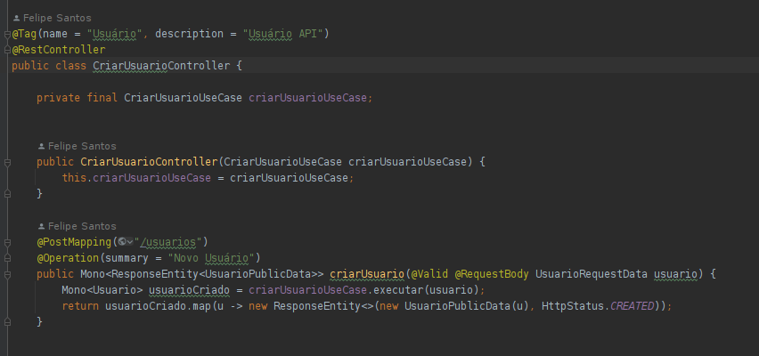

**DTO**
A implementação das definições de formato de dados feita no Use Case é implementada aqui, bem como as validações de dados já na fronteira da aplicação usando o pacote do Jakarta Validation e aplicando o princípio do fail fast.
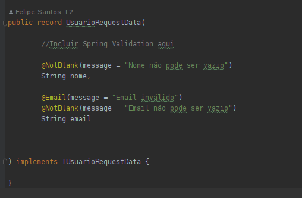

**EntitySchema**
Aqui temos a representação de nossa entidade voltada para um schema de dados de algum banco de dados, no nosso caso decidimos por utilizar o MongoDB (até por ser um dos requisitos do challenge), mas perceba que essa camada conhece nossa camada de entidade de negócio e ela sabe como construir essa camada mais interior e sabe construir-se a partir dela, respeitando a regra de camadas mais exteriores poderem utilizar as mais interiores. Utilizarmos uma camada específica para representar os dados de persistencia ao invés de simplesmente mapeá-los diretamente na camada mais interna da arquitetura nos permite maior flexibilidade, como por exemplo, termos diversas classes nessa camada, cada uma representando o armazenamento de dados de uma maneira diferente (uma para não relacional, outra para relacional, outra em csv, etc).
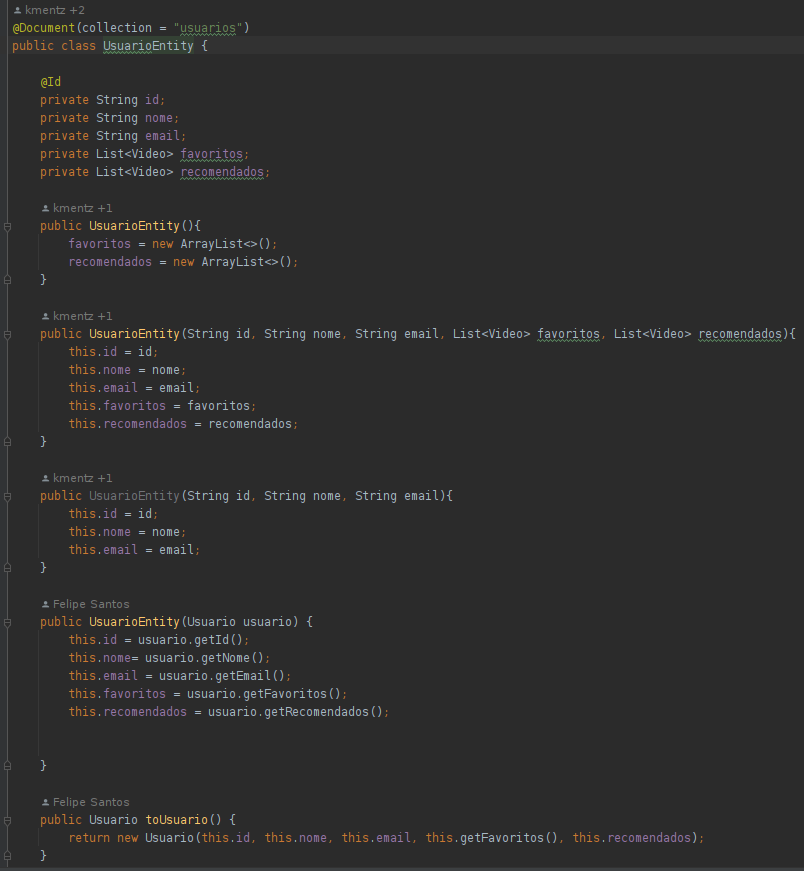

**Gateway** 
Essa é a camada que implementará as especificações das interações com as camadas mais externas, as quais a camada de entidade definiu anteriormente, essa camada é essencial para que a camada de Use Case realize suas atividades pois ela é que permitirá a comunicação com os entes mais externos. Novamente, o benefício do isolamento dessa responsabilidade é podermos substituir por outro gateway conforme a nossa necessidade, por exemplo, na situação abaixo, nosso gateway utiliza a camada de repositório para prover os métodos que serão posteriormente utilizados por nosso Use Case. Porém, seria plenamente possível que esses dados na verdade não fossem acessados através de um banco de dados, e sim de através de uma API externa por chamadas REST, separar as camadas nos permite criar um novo gateway que respeite o contrato definido na entidade e obtenha os dados dessa forma, bastando apenas injetar esse novo gateway em nosso Use Case e utilizá-lo.
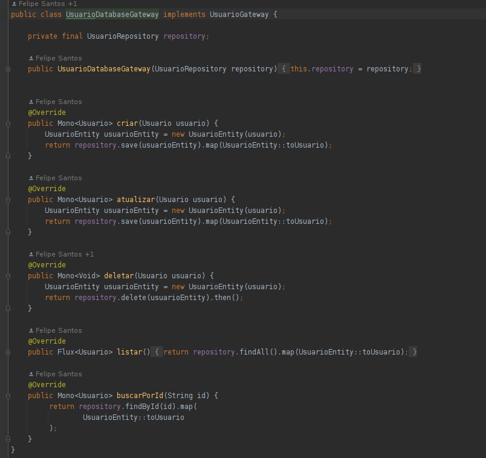

**Repository**
Essa é camada que será utilizada por nosso gateway para as chamadas ao  banco de dados, em nosso contexto, ela será provida pelo Spring Data conforme podemos ver abaixo
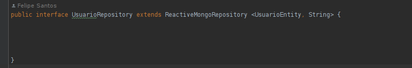

**O pacote config**
Como mencionamos anteriormente, nenhum Use Case está anotado como @Component, @Service ou algo semelhante para evitarmos o acoplamento de tecnologia naquela camanda. Para provermos beans desse tipo e injetá-los em nosso controller, criamos um pacote de configurações e nele criamos a classe MvcConfig que é responsável por fornecer ao Spring a maneira pela qual os Beans de Use Case serão injetados no Controller.
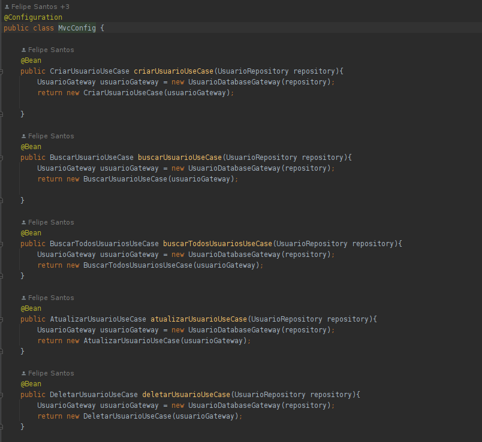

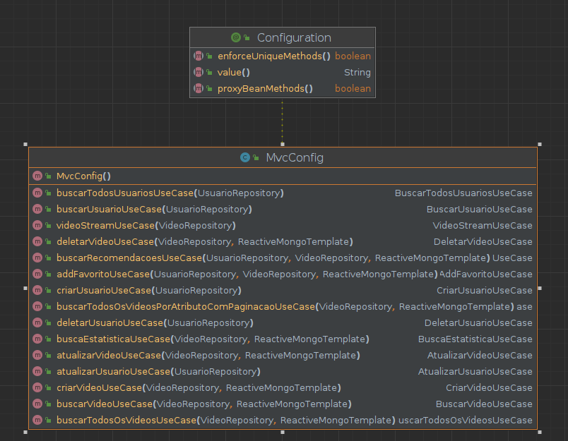

