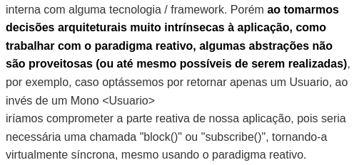
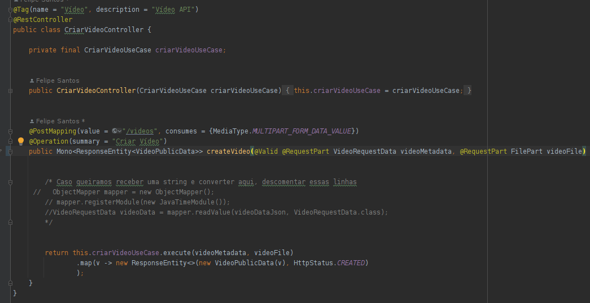
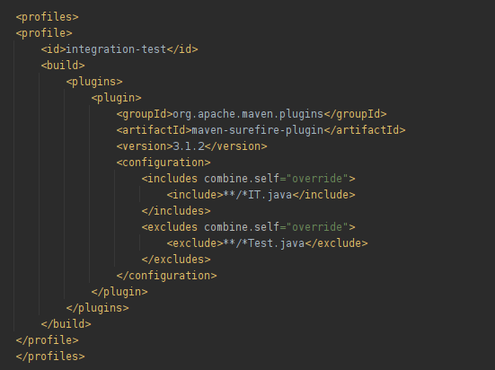
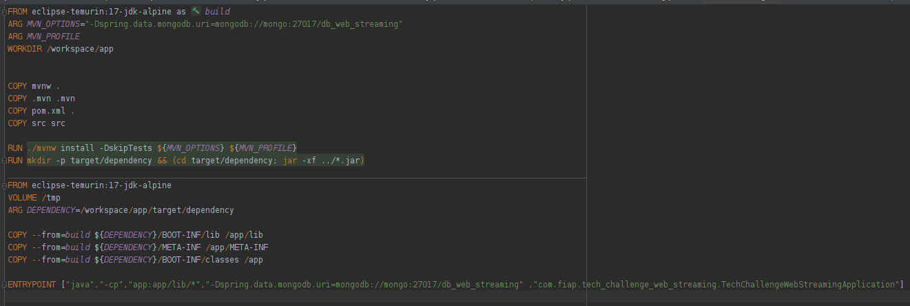
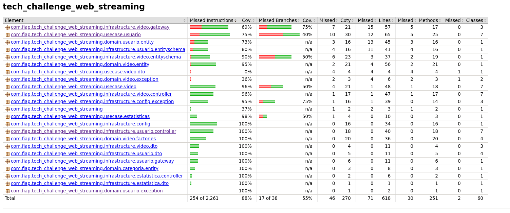

# Decisões Técnicas Relevantes 

## Arquitetura 
Conforme já descrito no decorrer do documento de arquitetura, utilizamos a CleanArch e por estarmos utilizando o paradigma reativo através do WebFlux, optamos por fazer com que os Controllers retornem as respectivas representações reativas Mono e Flux, a justificativa para tal (e contexto) foi dado na própria documentação de arquitetura, especificamente na área de Use Cases: 
[Arquitetura](https://github.com/kassimentz/TC_Fase4/blob/main/doc/Arquitetura.md)



---

## Forma de upload do vídeo 
Optamos por utilizar o formato **Multi-Part-Form-Data** para receber na mesma requisição o arquivo do vídeo e seus meta dados, conforme pode ser visto abaixo: 


A motivação para tal escolha foi poder receber ambos os dados em uma mesma requisição, de forma que caso uma validação falhe ou por algum motivo o arquivo não possa ser salvo, toda a operação de inserção é cancelada, evitando assim possíveis registros fantasmas que poderiam surgir. 

Para consumir o endpoint e enviar metadados e vídeo ao mesmo tempo, precisamos fazer a requisição de forma semelhante a essa: 

```bash
curl --location 'localhost:8080/videos' \
--header 'Content-Type: multipart/form-data' \
--form 'videoMetadata="{\"titulo\": \"teste 1\",
\"descricao\": \"inserção de vídeo teste 2\",
\"categoria\": \"TECNOLOGIA\",
\"dataPublicacao\": \"2024-01-25\"}";type=application/json' \
--form 'videoFile=@"/home/felipe/Downloads/videoplayback.mp4"'
```
Atenção pois na forma acima, é necessário informar o type do vidoMetadata para que o Jackson entenda que a string é um json e faça o parse do RequestPart automaticamente para nós.

Deixamos comentada no código uma forma alternativa que faz o parse manual da String em Json, possibilitando que a necessidade de passar o type seja suprimida.
 
 ```java
 
    ObjectMapper mapper = new ObjectMapper();
         mapper.registerModule(new JavaTimeModule());
        VideoRequestData videoData = mapper.readValue(videoDataJson, VideoRequestData.class);
        
 ```

---
## Stream do Vídeo 
Apesar de não ser um requisito, também fornecemos um endpoint para que o vídeo pudesse ser baixado, acessível através do recurso: 

```
\stream\{videoId} 
```
---
## Isolamento dos testes Unitários / Integração 
Optamos por filtrar a execução dos testes de integração na chamada mvn test para agilizar a execução do comando. Esse procedimento foi feito através dos profiles do maven, conforme podemos ver abaixo: 



## Utilização do Make
Criamos um Makefile para simplificar e agilizar nossos deploys e criação de nossa infra.

## Criação da Docker Image 
Criamos nossa própria imagem docker da aplicação e optamos por utilizar o multi-staged build, de forma que a aplicação final ficasse menor. 
Também optamos por explodir nosso jar final em camadas para tirarmos vantagem do OverlayFS (Filesystem do Docker), dessa forma, obtemos um reaproveimento maior das camadas inferiores e diminuimos o custo de armazenamento e o tempo para criação das imagens. 
Segue abaixo uma imagem de nosso DockerFile

a primeira área é responsável por buildar nossa aplicação, baixando as dependencias do maven. O artefato final gerado por esse estágio é explodido através do jar -xf

o segundo estágio copia os arquivos produzidos pelo primeiro, cada cópia irá gerar uma nova camada, sendo assim caso mudemos apenas as classes, o build não precisará gerar novamente as bibliotecas pois a mesma está em um camada mais inferior, inalterada. 
Como explodimos o jar, o entrypoint da aplicação não pode ser o java -jar tradicional, no lugar dele usamos o java -cp, especificando as pastas produzidas como classpath e executando nosso método main. O código abaixo é a cópia do entrypoint da imagem 
```docker
ENTRYPOINT ["java","-cp","app:app/lib/*","-Dspring.data.mongodb.uri=mongodb://mongo:27017/db_web_streaming" ,"com.fiap.tech_challenge_web_streaming.TechChallengeWebStreamingApplication"]
```
também passamos o endereço do mongo como argumento para a execução da aplicação.

---
## Test Coverage 
Utilizamos o Jacoco para produzir nossas métricas de test coverage, segue abaixo imagem das estatísticas produzidas (atendendo aos requisitos técnicos)


Pode-se ver que **obtivemos 88%** de cobertura total. 

