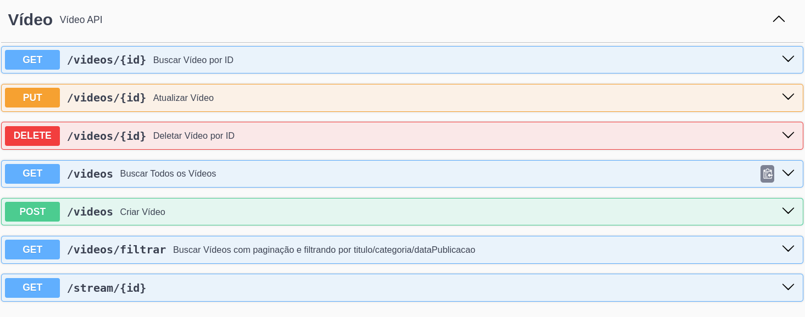
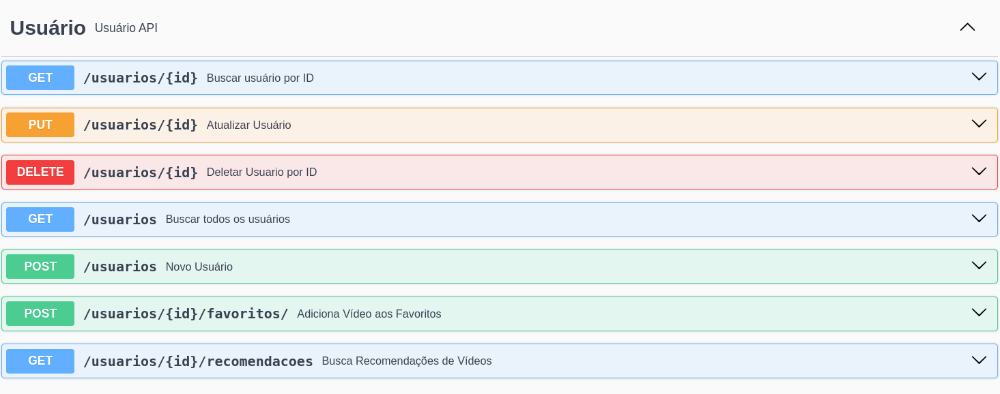
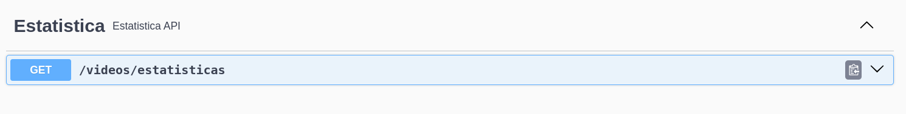

# Guia de Uso da Aplicação

## 1 - Provisionamento da Infra 

### Pré-Requisitos
- Possuir o Docker instalado em uma versão que já possua o compose embarcado (para testar basta executar docker compose version)
- Possuir o Make instalado (caso queira rodar os targets do Makefile) se estiver utilizando o Windows

### Makefile
Escolhemos abstrair os comandos necessários para compilar, testar, buildar a imagem e rodar a aplicação através do Make e seus targets no arquivo Makefile.

*É necessário possuir o Make instalado caso esteja utilizando Windows, no Mac e Linux não é necessário instalar pois os sistemas já o trazem por default* 

**Targets**

 - **compile**
     - executa um mvn compile 
 - **package**
     - executa um mvn clean package, ignorando os testes 
 - **unit-test**
   - executa os testes unitários da aplicação 
 - **integration-test**
   - executa os testes de integração da aplicação
 - **test-all**
   - executa os testes unitários e de integração
 - **test-coverage** 
   - executa os testes unitários e de integração, produzindo ao final o **relatório de cobertura de testes**
 - **run**
   - executa a aplicação chamando o maven spring-boot:run
 - **generate-image**
    - cria a imagem da aplicação com a tag "tech-challenge:latest"
- **run-stack**
  - cria a imagem da aplicação e executa o docker compose, subindo um container com a aplicação e outro com o MongoDB, expondo apenas a aplicação na porta 8080

### Como executar a aplicação 
Levando em consideração os targets acima, a forma mais simples de provisionar a aplicação será executar o seguinte comando no diretório TC_Fase4/tech_challenge_web_streaming/: 
```bash 
make run-stack
```
Após rodar o comando acima, a aplicação estará disponível na **porta 8080**

caso já possua uma instância do mongo rodando e queira apontar para ela ao invés da proposta na stack, basta alterar o endereço de conexão contido no arquivo application.yml do projeto e executar um 
```bash 
make run
#caso queira levantar uma instancia do mongo manualmente executar 

docker run --rm --name mongo-test -d -p 27017:27017 mongo:latest
```
Para gerar o test coverage report basta executar 
```bash 
make test-coverage
```
O teste será salvo em target/site/jacoco/index.html

Caso deseje chegar ao mesmo resultado sem utilizar o make, executar 
```bash 
./mvnw clean test
./mvnw test -P integration-test
./mvnw jacoco:reports
```
---
## 2 - Endpoints da aplicação 
A aplicação está configurada para utilizar o Swagger, portanto, toda a documentação dos endpoints estará acessível através da url: 
http://localhost:8080/webjars/swagger-ui/index.html#/

seguem imagens com os endpoints disponíveis 






Todos os endpoints podem ser testados diretamente pelo Swagger como será mostrado no vídeo de apresentação da aplicação, com exceção do endpoint de upload de vídeo pois não é possível informar o type do formData que estamos enviando. Para consumi-lo de maneira correta, podemos fazer o request através do Curl conforme abaixo: 
```bash 
curl --location 'localhost:8080/videos' \
--header 'Content-Type: multipart/form-data' \
--form 'videoMetadata="{\"titulo\": \"teste 1\",
\"descricao\": \"inserção de vídeo teste 2\",
\"categoria\": \"TECNOLOGIA\",
\"dataPublicacao\": \"2024-01-25\"}";type=application/json' \
--form 'videoFile=@"coloque o caminho do arquivo aqui"'
```
Ou, para simplificar, disponibilizamos um arquivo a ser importando no Postman que contempla o upload 
[Faça o Download aqui](https://github.com/kassimentz/TC_Fase4/blob/main/doc/Video%20API.postman_collection.json)


